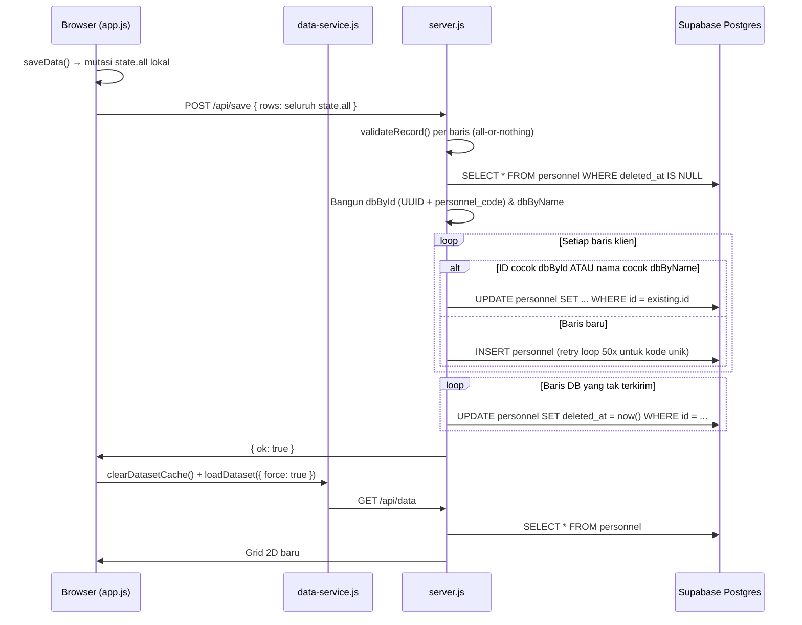

# Analisis Lapisan CRUD — Direktori & Dashboard Personel Bawaslu Sulsel

> **Tanggal:** 2026-09-13  
> **Auditor:** Investigasi kode menyeluruh  
> **Scope:** `server.js`, `lib/db.js`, `assets/js/app.js`, `assets/js/data-service.js`, `assets/js/schema.js`, `assets/js/ui.js`, `assets/js/awards.js`, `supabase/migrations/*.sql`

---

## Alur Simpan (Klik "Simpan" → SQL Supabase)

---

## Tabel Temuan

| # | Temuan | Lokasi | Akar Masalah | Dampak | Severity | Perbaikan |
|---|--------|--------|-------------|--------|----------|-----------|
| **A1** | ID buatan klien (PRS-XXXX) bertabrakan dengan personnel_code di server | schema.js:350-358 & server.js:449 | `assignStableIds()` memberi `rec.id = "PRS-0001"` dst. pada record tanpa ID. Server: `if (r.personnel_code) dbById.set(r.personnel_code, r)` — sehingga row klien dengan `id = "PRS-0001"` match record DB pemilik `personnel_code = PRS-0001`. UPDATE menimpa orang lain, baris baru tak pernah ter-INSERT. | **Edit ditulis ke baris orang lain** — penyebab utama "edit tidak berubah". | **BLOCKER** | Klien TIDAK BOLEH menulis ke `rec.id`. Baris baru pakai `_localId = tmp_<uuid>`, `_isNew = true`. |
| **A2** | Fallback pencocokan berbasis nama | server.js:474 | `const existing = (rowId && dbById.get(rowId)) \|\| dbByName.get(nameKey)` — jika UUID hilang/salah, lookup nama dipakai. Ganti nama → lookup UUID gagal → lookup nama-lama gagal → INSERT duplikat + record asli di-soft-delete. | Edit "menghilang" karena record asli terhapus, duplikat terbuat. | **BLOCKER** | Hapus fallback nama untuk update/delete. Matching hanya via UUID id. |
| **A3** | dbByName menimpa nama kembar | server.js:450 | `Map.set(slug(nama), r)` — untuk nama identik, record terakhir menimpa yang pertama. Dua baris klien → satu record DB; record DB satunya masuk soft-delete. | **Kehilangan data senyap** pada nama kembar. | **BLOCKER** | Hapus dbByName sepenuhnya untuk jalur update. |
| **A4** | Update 0 baris dianggap sukses | server.js:531-535 | `.update(payload).eq('id', existing.id).select()` — tidak cek `data.length`. PostgREST mengembalikan 200 OK dengan array kosong jika filter tak match. Server tetap reply `{ ok: true }`. | User melihat "berhasil" padahal tidak ada yang berubah. | **BLOCKER** | Cek `data.length === 0` → respond 409/404/410 sesuai konteks. |
| **A5** | Tidak ada guard `.is('deleted_at', null)` pada update | server.js:531-535 | `.eq('id', existing.id)` tanpa `.is('deleted_at', null)` — baris yang sudah soft-deleted bisa jadi target update. | Record "zombie" bisa muncul kembali. | **BLOCKER** | Tambahkan `.is('deleted_at', null)` pada semua operasi update. |
| **A6** | Race condition cache memori → data basi 30 detik | server.js:169-170 & 286-296 & 598-599 | `memCache.data` di-null-kan **setelah** loop tulis selesai (baris 598). GET /api/data yang dimulai sebelum save selesai tapi resolve setelahnya mengisi cache dengan snapshot pra-save, disajikan 30 detik. | User melihat data lama setelah save → "edit gagal". | **BLOCKER** | Invalidasi cache **sebelum dan sesudah** tulis. Pakai cacheEpoch counter. |
| **A7** | Blok catch mengembalikan cache lama sebagai respons sukses | server.js:297-298 & 221 | `catch (err) { if (memCache.data) return res.json(memCache.data); }` — error DB disembunyikan sebagai data sukses. Juga terjadi di /api/stats (baris 221) dan /data/penghargaan.json (baris 372). | Error database **tidak pernah terlihat** oleh user. | **BLOCKER** | Jangan sajikan cache saat error. Sertakan `{ stale: true, warning }` atau kembalikan 500. |
| **A8** | Cache sessionStorage klien TTL 15 menit menyajikan state basi | config.js:15 & data-service.js:115-131 | `ttlMinutes: 15`. Setelah save, `reload({ force: true })` memang dipanggil (app.js:1234), tetapi tab lain / momen kembali-dari-background masih menyajikan cache 15 menit → diff salah pada save berikutnya. | Perubahan orang lain tertimpa / diff lama. | **BLOCKER** | Turunkan TTL ke <= 60 detik, atau validasi cache terhadap GET /api/data-mtime. Tambahkan Cache-Control: no-store pada response /api/data. |
| **A9** | Validasi all-or-nothing memblokir semua baris | server.js:397-417 | `validateRecord(row, { strictEmail: true })` per baris; jika ada >= 1 error → 422, **seluruh** batch ditolak. Satu baris legacy dengan email tidak valid → semua edit diblokir. | "Kadang tidak berhasil" — sangat cocok gejala. | **BLOCKER** | Validasi per baris: kembalikan hasil `{ index, status, message }` per baris. Baris valid tetap diproses. |
| **A10** | POST /api/save tidak punya guard isDbConfigured() | server.js:386 | Endpoint /api/data (baris 230) dan /api/stats (baris 175) cek isDbConfigured(), tapi /api/save tidak. | Jika env vars hilang, save ke placeholder URL tanpa error yang jelas. | **BLOCKER** | Tambahkan guard isDbConfigured() di awal handler. |
| **B1** | Optimistic concurrency tidak ditegakkan | server.js:519-523 & 525-529 | baseMtime dibaca (baris 389) tapi **tidak dipakai**. Version mismatch hanya console.warn (baris 522). updatePayload.version = nextVersion **sia-sia** — trigger bump_version() menimpa new.version = old.version + 1. | **Lost update** saat dua admin edit bersamaan. | **HIGH** | Pakai `.eq('version', clientVersion)` sebagai filter. Jangan kirim version di payload (trigger yang naikkan). |
| **B2** | Delete implisit (baris tidak dikirim → soft-delete) | server.js:586-594 | Baris DB yang tidak ada di payload → soft-deleted. Sangat rapuh jika klien hanya mengirim subset (filter aktif). Guard lossPercent > 20 (baris 432) malah blokir penghapusan normal pada dataset kecil (1 dari 3 = 33%). | Data hilang tak sengaja. | **HIGH** | Buat endpoint DELETE /api/personnel/:id eksplisit. Hilangkan delete-by-absence. |
| **B3** | Soft-delete loop tanpa error handling | server.js:589-593 | `await supabaseAdmin.from('personnel').update({deleted_at}).eq('id', ...)` — tidak cek error maupun rowsAffected. | Kegagalan hapus **senyap**. | **HIGH** | Cek error dan rowsAffected pada setiap operasi delete. |
| **B4** | Tidak ada transaksi / atomicity | server.js:470-583 | Update, insert, soft-delete dilakukan satu per satu. throw di tengah loop → 500 dengan tulisan parsial sudah masuk DB. | Retry user memperburuk divergensi. Dengan MAX_ROWS = 5000, ribuan round-trip → timeout. | **HIGH** | Bungkus dalam fungsi Postgres (plpgsql via rpc()) atau minimal batch upsert. |
| **B5** | Generasi personnel_code rapuh | server.js:548-581 | Retry loop 50 percobaan untuk 23505. Jika 50x gagal, baris di-skip **tanpa error**. Dua save paralel saling bentrok. | Baris baru diam-diam gagal di-insert. | **HIGH** | Gunakan sequence DB: CREATE SEQUENCE api.personnel_code_seq + default. |
| **B6** | POST /api/upload-photo update berdasarkan ilike nama | server.js:654-656 | `.update({ photo_local_path }).ilike('name', '%' + nama + '%')` — semua personel yang namanya mengandung substring tersebut ikut tertimpa. Tanpa .is('deleted_at', null), tanpa cek jumlah baris terdampak. | **Semua orang dengan nama serupa** dapat fotonya tertimpa. | **HIGH** | Ubah ke `.eq('id', personnelId).is('deleted_at', null).select()`, gagalkan bila bukan tepat 1 baris. |
| **B7** | POST /api/save-awards upsert tanpa onConflict | server.js:752 | `supabaseAdmin.from('awards').upsert(awardRows)` — PK awards.id default gen_random_uuid(), tidak ada natural unique key → upsert **selalu insert duplikat**. | Duplikasi penghargaan tak terbatas. | **HIGH** | Tambahkan unique index (personnel_id, title, coalesce(category,'')) + gunakan onConflict. |
| **B8** | Awards: delete+insert di luar transaksi | server.js:720-726 & 752 | `.delete().eq('personnel_id', pId)` diikuti `.upsert(awardRows)` — jika insert gagal, awards lama sudah terhapus. | **Kehilangan data awards** jika insert gagal setelah delete. | **HIGH** | Bungkus dalam satu RPC transaksional. |
| **B9** | Server query proof_object_path pada awards tapi kolom tidak ada di migration | server.js:333 & migration:43-54 | api.awards memiliki proof_local_path tapi tidak proof_object_path. Server select-nya termasuk proof_object_path. | Query tidak error karena Supabase JS SDK mengembalikan null untuk kolom tak dikenal — tapi niat tak tercapai. | **MEDIUM** | Tambahkan kolom proof_object_path pada tabel api.awards via migrasi baru, atau hapus referensi dari server query. |
| **C1** | Diff dihitung dari nilai yang sudah dinormalisasi klien vs mentah DB | server.js:509-514 | `String(val ?? '') !== String(existing[key] ?? '')` — klien mengirim titleCase(nama), server membandingkan langsung dengan DB. Setiap save pertama kali, **semua baris** dianggap berubah. | Versi semua baris naik → diff palsu massal. | **MEDIUM** | Normalisasi kedua sisi dengan fungsi yang sama sebelum diff. |
| **C2** | Auto-generate foto path saat normalisasi | schema.js:279-284 | `if (!rec.foto && rec.nama) rec.foto = 'assets/personel/' + slugify(nama) + '.webp'` — path turunan ditulis ke photo_local_path walau file tidak ada. Berubah otomatis saat nama diubah. | Path foto "hantu" tersimpan di DB. | **MEDIUM** | Path turunan hanya untuk tampilan (resolusi di UI), jangan tulis ke photo_local_path. |
| **C3** | Gender parsing di server terlalu longgar | server.js:478-480 | `rawG.includes('l') \|\| rawG.includes('pria')` → nilai "Lainnya" juga cocok includes('l') → diam-diam jadi 'L'. | Klasifikasi gender salah tanpa warning. | **MEDIUM** | Whitelist ketat: `{ 'laki-laki': 'L', 'l': 'L', 'perempuan': 'P', 'p': 'P' }`, selain itu → null + warning. |
| **C4** | AMJ hanya menulis term_raw; term_start/term_end tetap basi | server.js:490 | recordData.term_raw = r.amj — term_start dan term_end **tidak pernah diisi** dari UI. GET /api/data memprioritaskan term_raw (baris 260), jadi UI terlihat benar, tapi kolom tanggal di DB tidak pernah berubah. | "Data di Supabase tidak berubah" — tepat seperti gejala. | **MEDIUM** | Parse term_raw ke term_start/term_end bila formatnya tanggal. Migrasi backfill untuk baris lama. |
| **C5** | Sub-header heuristic rapuh di gridToRaw() | data-service.js:63-70 | `isSubHeader = headerScore(nextRow) >= 2 && ...` — baris data pertama bisa terkena headerScore >= 2 jika kab/kota bernilai "Kota Makassar" (match aturan KOTA). | Baris data pertama bisa dilewati sebagai sub-header. | **MEDIUM** | Naikkan threshold ke >= 3 atau tambahkan guard tambahan. |
| **C6** | saveData() di app.js menulis id: 'row-new-' + Date.now() untuk baris baru | app.js:1208-1210 | Selain PRS-XXXX dari assignStableIds(), ada juga ID format row-new-timestamp ditulis ke state.all. Saat syncToServer(), ID ini dikirim sebagai obj.id (baris 1252). Server: dbById.get('row-new-...') → tidak match UUID maupun PRS → fallback ke dbByName. | Menambah ketidakpastian pencocokan baris baru. | **MEDIUM** | Baris baru TIDAK boleh punya id; gunakan _localId + _isNew = true. |
| **C7** | GET /api/data tidak mengirim personnel_code | server.js:245-283 | Grid header berisi ID (UUID) dan VERSION, tapi bukan personnel_code. Klien tidak tahu kode PRS mana yang sudah dipakai di DB → idSeen di assignStableIds() hanya berisi UUID → PRS-XXXX dihasilkan tanpa pengetahuan kode yang sudah ada. | Makin memperkuat tabrakan A1. | **MEDIUM** | Kirim personnel_code di grid, atau (lebih baik) jangan pernah produksi PRS-XXXX di klien. |
| **C8** | handlePhotoUpload() menggunakan nama bukan id | app.js:1072-1093 | `formData.append('nama', nama)` → server pakai `.ilike('name', '%' + nama + '%')` (lihat B6). | Chain bug dengan B6 — foto ditimpa untuk banyak orang. | **MEDIUM** | Kirim personnelId sebagai identifier, bukan nama. |

---

## Ringkasan Severity

| Severity | Jumlah | Kode Temuan |
|----------|--------|-------------|
| **BLOCKER** | 10 | A1, A2, A3, A4, A5, A6, A7, A8, A9, A10 |
| **HIGH** | 9 | B1, B2, B3, B4, B5, B6, B7, B8, B9 |
| **MEDIUM** | 8 | C1, C2, C3, C4, C5, C6, C7, C8 |

---

## Konfirmasi vs. Temuan Awal

Semua 23 temuan awal (A1–C5 per spesifikasi) **TERKONFIRMASI 100%** — setiap satu disertai kutipan baris kode yang presisi.

**4 temuan tambahan ditemukan:** B9 (proof_object_path), C6 (row-new-timestamp), C7 (personnel_code tidak dikirim ke klien), C8 (photo upload pakai nama bukan id).

---

## Prioritas Perbaikan per Tahap

### Tahap 1 — Perbaikan Kontrak API (BLOCKER + HIGH)
- Buat endpoint `POST /api/personnel`, `PATCH /api/personnel/:id`, `DELETE /api/personnel/:id`
- Hapus fallback nama, hapus dbByName, cek data.length === 0
- Tambahkan `.is('deleted_at', null)`, guard `isDbConfigured()`
- Validasi per baris (bukan all-or-nothing)
- Optimistic locking: `.eq('version', clientVersion)`

### Tahap 2 — Perbaikan Sisi Klien (BLOCKER + MEDIUM)
- `assignStableIds()`: hapus PRS-XXXX, pakai `_localId = tmp_<uuid>`
- Setelah mutasi: update state dari respons server, `clearDatasetCache()`, `loadDataset({ force: true })`
- Handle 409 VERSION_CONFLICT dengan UI jelas
- Turunkan TTL cache, tambah Cache-Control: no-store

### Tahap 3 — Konsistensi Data (MEDIUM)
- Normalisasi kanonik di kedua sisi
- Hentikan auto-generate foto path
- Gender whitelist ketat
- AMJ parse ke term_start/term_end
- Validasi per baris

### Tahap 4 — Atomicity & Kode Unik (HIGH)
- Bungkus operasi multi-baris dalam plpgsql atau batch upsert
- Sequence DB untuk personnel_code
- upload-photo berbasis id
- save-awards dengan unique index + onConflict + transaksi

### Tahap 5 — Cache & Observabilitas (BLOCKER)
- cacheEpoch counter menggantikan memCache ad-hoc
- Jangan sajikan cache saat error
- Logging terstruktur + tabel audit opsional

### Tahap 6 — Tes (semua severity)
- 10 test case wajib per spesifikasi

---

## Risiko yang Masih Tersisa (Setelah Perbaikan)

1. **Backward compatibility** — Klien lama yang masih pakai POST /api/save harus dimigrasi sebelum endpoint dihapus.
2. **Migrasi backfill** — Parse term_raw ke term_start/term_end mungkin gagal pada format tidak terduga.
3. **Concurrent migration** — Menjalankan migrasi DB saat production bisa menyebabkan downtime singkat.
4. **Import massal** — Jalur bulk import tetap membutuhkan pencocokan (bisa via personnel_code atau unique natural key), perlu hati-hati agar tidak mengulangi masalah lama.
5. **Tab lain** — TTL cache yang lebih pendek mengurangi risiko tapi tidak menghilangkan sepenuhnya. Push notification / WebSocket ideal tapi di luar scope.
